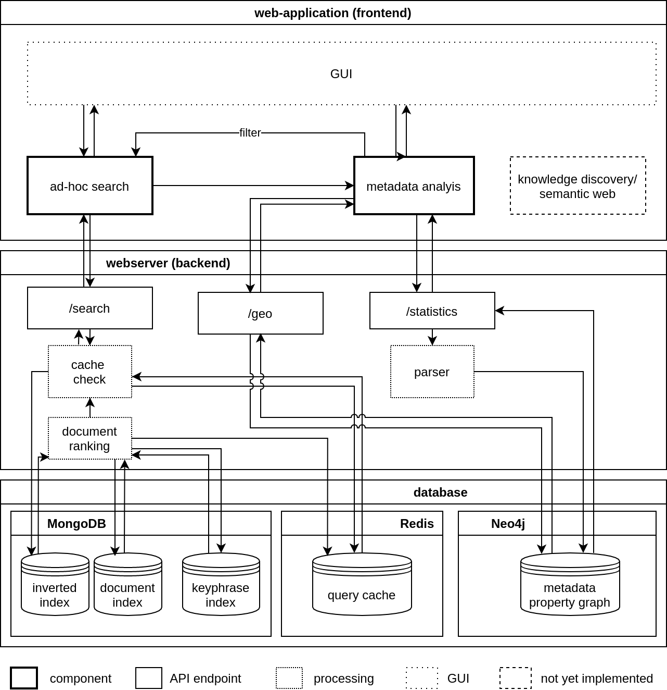

# Covid Open Research Engine


## Description


## Table of Contents


## Features
- **Ad-hoc search:**
- **Document level metadata analysis:**
  - **Analyze papers by location:**
  - **Analyze publications by authors:**
  - **Analyze publications by institutions:**


## Quick Start

### Docker Installation


### Manual Installation

#### Prerequisites

- Mongo DB: https://www.mongodb.com/de
- Neo4j: https://neo4j.com/
- Redis: https://redis.io/

#### Database Configuration:

#### Covid Open Research Dataset (CORD-19)

- Download the dataset from one of the following sources:
    - https://www.kaggle.com/allen-institute-for-ai/CORD-19-research-challenge
    - https://www.semanticscholar.org/cord19

- Extract data to /dataset directory (create the directory if not existent). The file structure should be the following after the previous steps:

```
dataset

└───arxiv
|      ######.json
|      ######.json
|      ...
|
└───biorxiv_medrxiv
|      ######.json
|      ######.json
|      ...
|
└───biorxiv_medrxiv
|      ######.json
|      ######.json
|      ...
|
└───cord_19_embeddings_4_24
|      cord_19_embeddings_4_24.csv
|
└───custom_license
|      ######.json
|      ######.json
|      ...
|
└───noncomm_use_subset
|
| COVID.DATA.LIC.AGMT.pdf
| json_schema.txt
| metadata.csv
| metadata.readme
```


## Architecture



## References:

[1] Christopher D. Manning, Prabhakar Raghavan, and Hinrich Schütze. 2008. Introduction to Information Retrieval. Cambridge University Press, USA.


