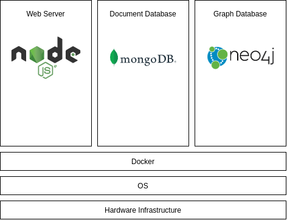

# Covid Open Research Engine


<p align="center">
  
</p>

## Description
The opening literature research is a fundamental part of scientific work which takes oftain a substential ammount of time.  This need is  further reinforced by the continuously increasing volume of scientific publications.

...

The goal of this work is the development of the basis for an intelligent search engine with the aim of supporting scientific literature research on the topic of COVID-19, providing the user additional information on the topic and the surroundings of the users individual research.

## Features

The scope of the current state of the search engine lies on the processing of given documents provided by the CORD-19 Dataset and both ad-hoc and metadata information retrieval provided by the developed search engine and its web interface. Additional components such as a web crawler for identifying new publications are currently missing but are planned for a later date in order to update the data volume to newer COVID-19 literature and the functionality to use this project as a small scale general purpose scientific search engine.

### Processing:
- A
- B

### Web-Application:
- **Ad-hoc search:**
- **Document level metadata analysis:**
  - **Analyze papers by location:**
  - **Analyze publications by authors:**
  - **Analyze publications by institutions:**


## Quick Start

### Docker Installation

<p align="center">
  
</p>

### Manual Installation

#### Prerequisites

- Mongo DB: https://www.mongodb.com/de
- Neo4j: https://neo4j.com/
- Redis: https://redis.io/

#### Database Configuration:

#### Covid Open Research Dataset (CORD-19 <cite>[1]</cite>)

- Download the dataset from one of the following sources:
    - https://www.kaggle.com/allen-institute-for-ai/CORD-19-research-challenge
    - https://www.semanticscholar.org/cord19

- Extract data to /dataset directory (create the directory if not existent). The file structure should be the following after the previous steps:

```
dataset

└───arxiv
|      ######.json
|      ######.json
|      ...
|
└───biorxiv_medrxiv
|      ######.json
|      ######.json
|      ...
|
└───biorxiv_medrxiv
|      ######.json
|      ######.json
|      ...
|
└───cord_19_embeddings_4_24
|      cord_19_embeddings_4_24.csv
|
└───custom_license
|      ######.json
|      ######.json
|      ...
|
└───noncomm_use_subset
|
| COVID.DATA.LIC.AGMT.pdf
| json_schema.txt
| metadata.csv
| metadata.readme
```


## Documentation of specific components

- [document processing + construction of data models (CORD-19)]()
- [web-application backend](web_application/backend/README.md)
- [web-application frontend]()


## Roadmap
- Implementation of filters for queries based on retrieved metadata (e.g. specific countries, authors)
- Additional processing and extension of document metadata
- Advanced search query processing &rarr; natural language understanding
- Development of an document and database level knowledge graph in order to provide short answers to user given search queries
- Development of a web crawler in order to search for new literature in the area of COVID-19 or new topics
- ...


## References:

[1] Christopher D. Manning, Prabhakar Raghavan, and Hinrich Schütze. 2008. Introduction to Information Retrieval. Cambridge University Press, USA.

[2] Lu Wang L, Lo K, Chandrasekhar Y, et al. CORD-19: The Covid-19 Open Research Dataset. Preprint. ArXiv. 2020;arXiv:2004.10706v2. Published 2020 Apr 22. 

[3] Snyder, Hannah. (2019). Literature review as a research methodology: An overview and guidelines. Journal of Business Research. 104. 333-339. 10.1016/j.jbusres.2019.07.039. 

[4] Arif Jinha. Article 50 million: An estimate of the numberof scholarly articles in existence.Learned Publishing,23(3):258–263, 2010.