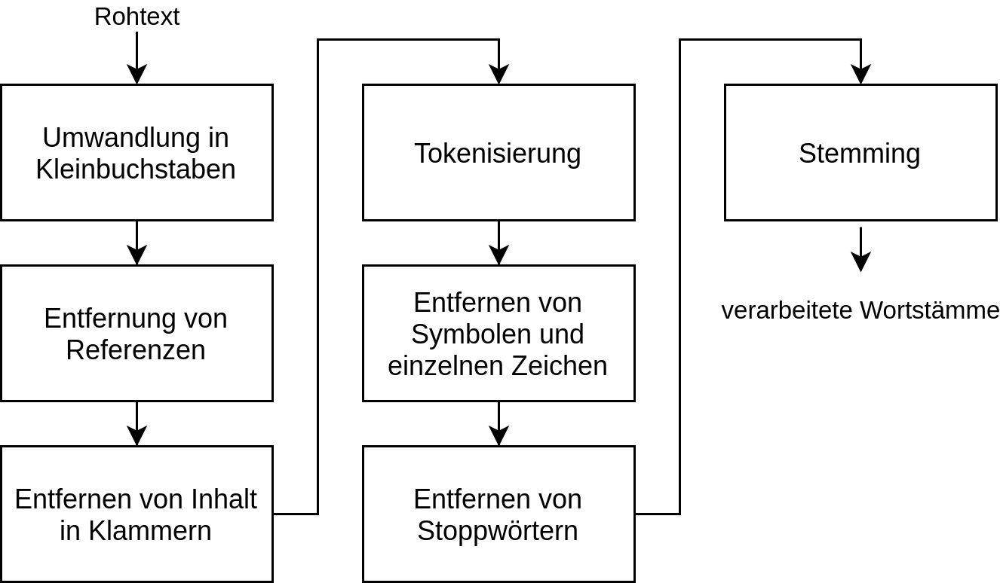

# covid19-search

## CORD-19 Data Processing

### Text Preprocessing

the following steps are performed in order to improve the quality of the queryable phrases:

- **Transforming all characters to lowercase:**
- **removing citations:**
- **remove all content in brackets:**
- **tokenize:**
- **remove symbols and single characters:**
- **lemmatize tokens**:

## Covid-19 Insigths Search Engine (Web Application)

## References:
[1] Christopher D. Manning, Prabhakar Raghavan, and Hinrich Schütze. 2008. Introduction to Information Retrieval. Cambridge University Press, USA.
