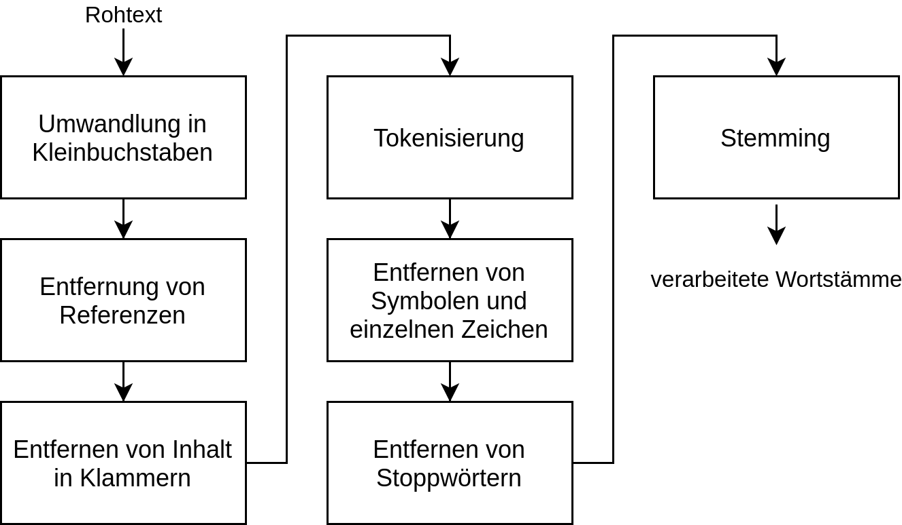

# Processing

This readme file describes the perocessing of the CORD-19 dataset in order to provide a suitable set of data models for the information retrieval task. This directory includes all relevant scripts for processing the CORD-19 data for using them in the search engine. Before performing the processing the [required prerequesites](../README.md) should be installed and configured.


## Inverted Index and Document Index Construction

The processing and creation of the inverted index and document index data model is performed in the `document-index-construction-mongodb.ipynb` notebook.

### Text Preprocessing

In order to provide a sufficient data model for the boolean information retrieval model several preprocessing steps are performend in order to minimize the required space and optimize the rate of matched documents by improving the quality of the queryable phrases.
Therefore the following steps are performed:

- **Transforming all characters to lowercase:**
- **removing citations:**
- **remove all content in brackets:**
- **tokenize:**
- **remove symbols and single characters:**
- **lemmatize tokens**:

<p align="center">
  
</p>


### Author and Insitution Processing


### Data Model

#### Inverted Index

For each document in the CORD-19 dataset a unique id is assigned. This id is used in order to identify the corresponding document in the document index (as described below).  

```json
{
    _id: 2, 
    document_title: "Global Analysis of...",
    authors: [
        {
            author: "D. Bichara",
            institution: "undefined"
        }
    ],
    abstract:"We formulate a multi-group...",
}
```

#### Document Index

```json
	{
		_id: "percentu",
		doc_ids: [
			{
				doc_id: 1290, 
				count: 
				{
					title: 0,
					abstract: 0,
					body_text: 2
				}
			},
			{
				doc_id: 44416, 
				count: 
				{
					title: 0,
					abstract: 2,
					body_text: 0
				}
			},
		]
	}
```

### Model Creation

In order to minimize the runtime of the document and inverted index construction the data is processed in parrallel. Therefore the CORD-19 files are divided into chunks with a default size of 128 using the `create_chunks` function and are processed in a parrallel manner using pythons `multiprocessing` library on the `process_chunk` function.

```python
"""
@param: a list of all files
@param: the desired size of a chunk (per default 128)
@returns: a list of chunks: list of tuples [(file path, document id), ...]
"""
def create_chunks(files, chunk_size=128)
```

```python
"""
@param: chunk of documents: tuple (file path, document id)
@param: 
@param:
"""
def process_chunk(args, update_doc_idx=True, update_inv_indx=True)
```

In the `process_chunk` function

#### Redis Cache

The default algorithm for creating the inverted index 

<p align="center">
  
</p>

**Fig 2:** analyisis of the different database operations that are required in order to create the inverted index database model.

</br>

Since the connection to the database is only established once for each processed chunk and is therefore performed significantly less frequently than the other operations, the runtime is not a problem here.

However, the read access, which is carried out several times for each document, can be identified as a relevant bottleneck. In order to minimize the time required for a read access, an additional Redis cache is used, in which the most frequently used word stems and document IDs are managed.Through this measure the runtime of the inverted index construction can be improved significantly.


## Metadata Property Graph

### Data Model

<p align="center">
  
</p>


## References:
[1] Christopher D. Manning, Prabhakar Raghavan, and Hinrich Schütze. 2008. Introduction to Information Retrieval. Cambridge University Press, USA.
