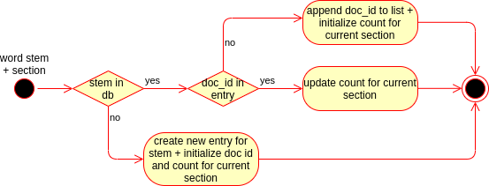
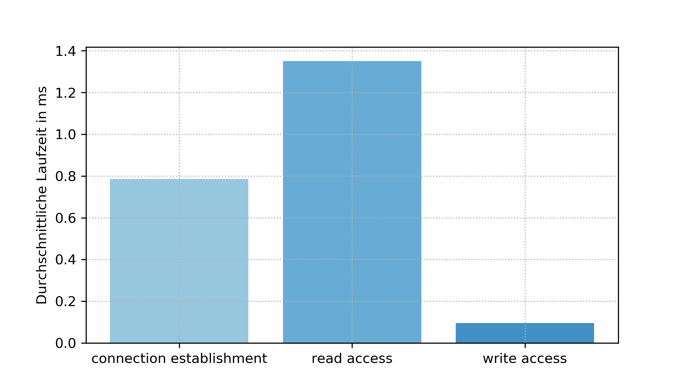
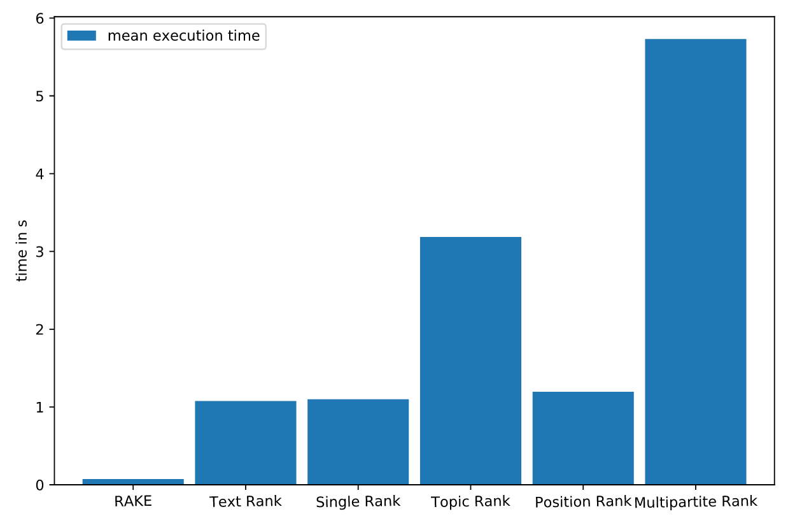
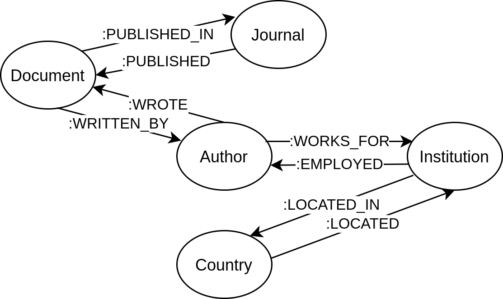

# Document Processing + Construction of the Data Models

The following sections of this document describe the preprocessing and processing of the CORD-19 dataset in order to provide a suitable set of data models for the information retrieval tasks used in the search engine. The `/processing` directory includes all relevant scripts used for the processing of the CORD-19 dataset as described in the following sections. Before running those scrits the [required prerequesites](../README.md) should be installed and configured.

## Overview

The processing of the given dataset consists of two main parts. First the documents of the CORD-19 dataset which are given in a json format are preprocessed using the following steps:

- extract the relevant information from the file
- perform additional data cleaning 
-  vertical data migration from additional sources (GRID, ISO 3166-1 Codes)

Hereby the preprocessing which is used as a basis for the cration of the data models, as depicted in fig 1, takes place in three different domains which are described in more detail in the following section ([CORD-19 Preprocessing]())

> Note: The processing of the references is currently not used due to the poor performance.

</br>

<p align="center">
  
</p>

**Fig 1:** Schematic visualization of the processing steps performed as well as the usage of additional datasources in order to create the data models.

</br>

## CORD-19 Preprocessing

### Authors/ Insitutions Processing
The raw information on the involved authors and institutions are extracted from the json file using the functionality implemented in the `DataLoader` class in `literature.py`. The raw information is further processed by multiple tasks which can be selected based on the desired data policy (keep all data, remove invalid data).

The authors which are each represented as a own object containing a first name, a list of middle names (can be empty) and a last name. For the processing of the authors, which is performed in the `__parse_author` function, the following steps can be enabled:

- **clean names (`__clean_name_part`):** removes all characters that are not valid in names (ISO basic Latin alphabet and '-' character)
- **join + normalize names (`__join_name`):** combines the single components of the name into a single string and shortens the first and middle names to the following form if `normalize_names` is set to true: e.g. Stephen William Hawking &rightarrow; S. W. Hawking. This normalization can be used in order to match authors from the documents reference list.
- **plausibility check (`__is_name`):** basic check whether the given name is plausible. The given name is invalid if the length of the last name is shorter than two characers, the first name does not contain any valid character or fist name is empty or whitespace.

The extracted institution can be also further processed using the `__parse_institution` function either to check the plausibility of an insitution or to expand the data by the geographical location of the institution. The matching of the institutions both for the plausibility check and the location lookup the Global Research Identifier Database [2] and a list of ISO 3166-1 Codes [3] is used. In order to improve the matching rate of the institutions a partial fuzzy string matching technique using the [fuzzyset](https://github.com/axiak/fuzzyset/) python package is used. 


### Document Preprocessing

In order to provide a sufficient data model for the boolean information retrieval model several preprocessing steps are performend in order to minimize the required space and optimize the rate of matched documents by improving the quality of the queryable phrases.
Therefore a number of various steps are performed on each section of the document (title, abstract body). The sections are each extracted from the json document using the functionality implemented in the `DataLoader` class in `literature.py`. The following preprocessing tasks were implemented as a pipeline (`preprocessing.py`) where the class `NLPPipeline` is used as a base processing block. For this block, additional modules that define an arbitrary type of processing step for the abstract `transform` function of the base class `NLPTrasformer`, can be registered.

- Transforming all characters to lowercase: `ToLowercase`
- Removing citations `CitationRemover`
- Remove all content in brackets `ContentInBracketsRemover`
- Tokenization `Tokenizer`
- Remove stopwords `StopwordRemover`
- Removal of symbols and single characters `SymbolRemover`, `NonAlphanumericRemover`
- Stemming `Stemmer`

After that a list of stopwords that exist in the given text is returned. In order to improve the performance of the following creation of the inverted index, duplicate word stems are grouped using the `collections.Counter` datatype which can be used for counting hashable objects. 

### Reference Processing

>NOTE: Due to the currently inefficient state of the corresponding data model this task is only presented in this documentation (for additional information on the current mechanisms please refer to `literature.py` and `metadata-property-graph-neo4j.ipynb`). 


## Inverted Index and Document Index Construction

The ad-hoc search which is the most important component of every modern search engine and allows the user to search for a specific topic using a search term. In order to enable a fast full text search which is required for such a information retrieval system an inverted index as well as a document index is created. The creation of the inverted index and document index which is the main component of the ad-hoc information retrieval system  is performed in the `document-index-construction-mongodb.ipynb` notebook using additional utility functions from `literature.py`, `preprocessing.py`, `grid.py` and `metadata.py`.


### Inverted Index and Document Index - Data Models

For the information retrieval task the establishment of a suitable data model is a crutial criteria in order to provide a memory and performance efficient solution which can be scaled in the required domain. In this task the requirements for this data model is not to the extend as it would be for a normal search engine due to the relatively small size of the dataset. Hence the focus of the data model is mainly focused on the simplicity rather than the implementation of advanced techniques such as inverted index compression or similar methods.

As a basis for the following data model the structure shown in the pulication of Trucia et. al. is used as a starting point. In the following part the adaptions made to the data model should now be described.

For each document in the CORD-19 dataset a unique id is assigned which is then used in both mentioned data models in order to identify the corresponding document. In the document index the document index is further extended by the most important document information, namely the document title, the document abstract, as well as a list of associated authors and the institution they are attending, which is shown in the search engine user interface as a description for each document given a search result.

```json
{
    _id: 2, 
    document_title: "Global Analysis of...",
    authors: [
        {
            author: "D. Bichara",
            institution: "undefined"
        }
    ],
    abstract:"We formulate a multi-group...",
}
```

In order to provide a fast full text search for the documents a inverted index datastructure is created. In this a entry is created for each word or more precisely the corresponding word stem existent in at least one document. For this word stam a list of document ids which contain the given stem is consecutively updated. In addition to the document id a additional object which holds the number of occurrences which is later used for the document ranking.

```json
{
    _id: "percentu",
    doc_ids: [
        {
            doc_id: 1290, 
            count: 
            {
                title: 0,
                abstract: 0,
                body_text: 2
            }
        },
        {
            doc_id: 44416, 
            count: 
            {
                title: 0,
                abstract: 2,
                body_text: 0
            }
        },
    ]
}
```

### Model Creation

In order to minimize the runtime of the document and inverted index construction the data is processed in parrallel. Therefore the CORD-19 JSON files (file paths) are divided into chunks with a default size of 128 using the `create_chunks` function and are processed in a parrallel manner using pythons `multiprocessing` library on the `process_chunk` function. For each parallel `process_chunk` task a new database connection to both the MongoDB is established. After that each filepath, document id tuple given by a data chunk is further processed in order to update the document ind inverted index. Therefore the document is loaded using the `DataLoader` implementation.
Using this abstract document representation the document title is loaded. In order to filter out invalid and unneccesary documents the title is further analysed both on empty and non-english (`is_english` in `literature.y`) titles. In order to determine the language of the title the [pycld2](https://github.com/aboSamoor/pycld2)  python implementation of the Compact Langauge Detect 2 model is used. If one of these criteria is met the current document is discarded.

After that the document index is updated based on the document title, the involved authors and institutions and the abstract. For those the preprocessing steps are applied as described in the previous sections. As a final step the inverted index is updated using the `update_inverted_index` function using the processed word stems for each document section (title, abstract, body).


```python
"""
@param: a list of all files
@param: the desired size of a chunk (per default 128)
@returns: a list of chunks: list of tuples [(file path, document id), ...]
"""
def create_chunks(files, chunk_size=128)
```

```python
"""
@param: chunk of documents: tuple (file path, document id)
@param: 
@param:
"""
def process_chunk(args, update_doc_idx=True, update_inv_indx=True)
```


In the `update_inverted_index` function the inverted index is updated consecutively for each word stem using an adapted algorithm which is based on the algorithm shoown in Trucia et. al. [4]. Given a list of word stems with the corresponding number of ocurrences and a docuemt section the algorithm iterates over all word stems. If the word stem is not existent in the inverted index database the word stem is added to the database using a configured instance of the inverted index data model. Hereby the doc_id field is set to the current document id and the count section is initialized based on the count of the stem in the given section. All other sections are initialized to zero.
If the stem was already added to the database the existence of the given doc_id in the data object is checked. If the document id is not in the data object. The document id with the correspronding count section is added to the data object. Given the case that the document id does exist in the data object only the number of occurences is updated.


<p align="center">
  
</p>

**Fig 2:** Algorithm used in order to update the inverted index model given the three different states the database model can be situated in.

#### Redis Cache

Due to the lack of scalability of the default algorithm some additonal countermeasures are implemented in order to improve the database operations. Therefore the different database operations (connection, read, write) are benchmarked on a given database with approximately 20.000 processed documents. The results obtained from the tests are shown in Figure 2.


<p align="center">
  
</p>

**Fig 3:** analyisis of the different database operations that are required in order to create the inverted index database model.

</br>

Since the connection to the database is only established once for each processed chunk and is therefore performed significantly less frequently than the other operations, the runtime is not a problem here.

However, the read access, which is carried out several times for each document, can be identified as a relevant bottleneck. In order to minimize the time required for a read access, an additional Redis cache is used, in which the most frequently used word stems and document IDs are managed.Through this measure the runtime of the inverted index construction can be improved significantly.

The caching of entries is performed on in addition to each MongoDB using either the `update_cache_stem` or the `update_cache_doc_id` function. The queries `is_stem_existent` and `is_doc_id` existend instead of the plain MongoDB query (as described in the [Model Creation]() section). For both functions the lookup in the redis cache is the preffered method. If this does not return any result the MongoDB query is performed in order to obtain a reliable statement whether the wanted object does exist in the correct shape.

```python
"""
@param word stem
@param database object holding the connection to the redis instance
@param (database object holding the conntection to the MongoDB instance)
"""
def update_cache_stem(stem, redis_cache):
def is_stem_existent(stem, inverted_index_collection, redis_cache):
```

```python
"""
@param word stem
@param document id in which the given stem is located
@param database object holding the connection to the redis instance
@param (database object holding the conntection to the MongoDB instance)
"""
def update_cache_doc_id(stem, doc_id, redis_cache):
def is_doc_id_existent(stem, doc_id, inverted_index_collection, redis_cache):
```

## Keyphrase Index

In order to provide the user for each search query with a list of relevant alternative keyphrases a keyphrase index is created containing the most valuable keyphrases for every document. The extraction and the processing of the keyphrases as well as the creation of the data model is performed in the `keyphrase-index-construction-mongodb.ipynb` notebook.

### Keyphrase Index - Data Model

The data which is required for the keyphrase index which is also stored in the MongoDB is stored in a JSON format. Therefor for each document a new object containing the document id and a list of keyphrases is created. The list of keyphrases contains a list of at most ten different keyphrases extracted by the keyphrase extraction algorithm with a corresponding score which determines the relevance of the extracted keyphrase.

```json
{
    _id: 1,
    keyphrases: [
      {
        keyphrase: "hospital occupancy",
        score: 4.283333333333333
      },
      {
        keyphrase: "reproductive number",
        score: 4.22463768115942
      },
      ...
    ]
}
```


### Selection of the Keyphrase Extraction Model

In order to find a suitable technique for both a efficient execution as well as a high quality of keyphrases different graph based keyphrase extraction techniques using the implementations from the [python keyphrase extraction (pke)](https://github.com/boudinfl/pke) and [python-rake](https://github.com/fabianvf/python-rake) modules were examined. Therefore the mean execution time needed in order to process a document was measured. (The required sourcecode and results are documented in `keyphrase-extraction-tests.ipynb`)

Due to the poor runtime performance of the most extraction algorithms which can be seen as unacceptable in terms of the overal runtime required in order to process a large set of documents. Since the results of the Rapid Automatic Keyword Extraction (RAKE) model seems quite acceptable compared to the other models combined with the fact that only a subset of each document is used for the compuation of the most relevant keyphrases for a search term, this technique is selected for the keyphrase extraction task.

<p align="center">
  
</p>

**Fig 4:** comparison of the different runtimes required by the given keyphrase extraction models in order to process a document averaged over a set of ten documents.


### Model Creation

The creation of the metadata property graph is performed in parralel as described previously for the document- and inverted index using an modified `process_chunk` function. In this case the internal processing steps used in order to process a document are reduced to a minimal scope. For each document in a chunk the content of the different text sections (title, abstract and body) are concatinated and then processed by the RAKE model. The first ten keyphrases with the highest score (or less depending on the number of extracted phrases) are saved in the MongoDB database.


## Metadata Property Graph

For the advanced information retrieval based on the document metadata a graph database is used containing a set of basic metadata. The processing of the documents in order to create the mentioned graph database is located in the `metadata-property-graph-neo4j.ipynb` notebook. This notebook is based on a similar structure as the script used for the inverted- and document index construction and therefor uses the same utility functions located in `literature.py`.

### Metadata Property Graph - Data Model

Center of the data model is the `Document` node which contains properties both for the document title and the document id . In order to describe a given document in a more detailed way a direct bidirectional relations is created for at least one instance of the Author Node (name) which is again linked to an instance of the Institution Node (name). For each institution a geographical location is associated using an instance of the Country Node (name, code). In addition to the involved authors a connection to an Journal is established (if the journal is given in the metadata).

</br>


<p align="center">
  
</p>

**Fig 5:**


### Model Creation

The creation of the metadata property graph is performed in parralel as described previously for the document- and inverted index using an modified `process_chunk` function. For each file given in a chunk the document title, the journal name and the authors are determined using the utility functions as described in the [CORD-19 Preprocessing]() section. Each of these fields are checked for `None` values which are replaces by the string literal `undefined` in order to provide a valid data format for the Neo4j database. In a final step the given values are added in form of the previously described data object.

## References:
[1] Christopher D. Manning, Prabhakar Raghavan, and Hinrich Schütze. 2008. Introduction to Information Retrieval. Cambridge University Press, USA.

[2] [ISO 3166-1 List](https://datahub.io/core/country-list): licensed under a  [Open Data Commons Public Domain Dedication and License v1.0](https://opendatacommons.org/licenses/pddl/index.html)

[3] [Global Research Identifier Database](https://www.grid.ac/): licensed under a
[Creative Commons Public Domain 1.0 International Licence](https://creativecommons.org/publicdomain/zero/1.0/)

[4] Truică, Ciprian-Octavian & Rădulescu, Florin & Boicea, Alexandru. (2017). Building an Inverted Index at the DBMS Layer for Fast Full Text Search. Control Engineering and Applied Informatics. 19. 94-101. 