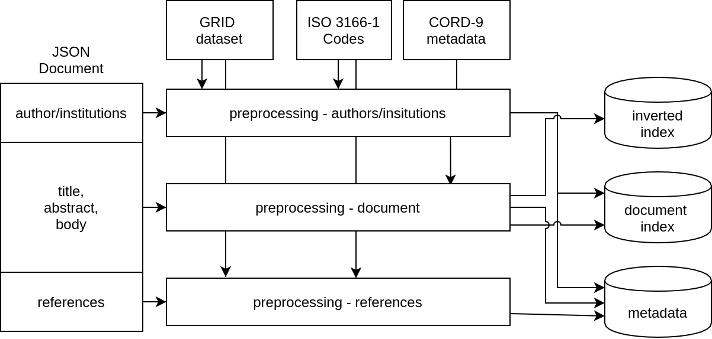
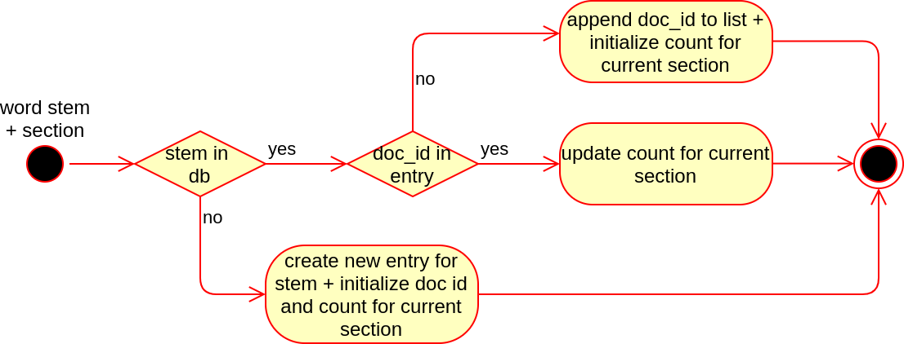

# Document Processing + Construction of the Data Models

The following sections of this document describe the preprocessing and processing of the CORD-19 dataset in order to provide a suitable set of data models for the information retrieval tasks used in the search engine. The `/processing` directory includes hereby all relevant scripts used for the processing of the CORD-19 dataset as described in the following sections. Before running those scripts the [required prerequesites](../README.md) containing the databases and the CORD-19 dataset should be installed and configured.

## Overview

In order to create the required data models out of the CORD-19 dataset the following two steps are performed. First the documents of the CORD-19 dataset which are given in a json format are preprocessed using the following methods:

- extract the relevant information from the file
- perform additional data cleaning 
- vertical data integration from additional resources

After that the required data models containing the an document index, an inverted index and a metadata property graph are created based on the data provided by the previous processing steps.

</br>

<p align="center">
  
</p>

**Fig 1:** Schematic visualization of the processing steps performed as well as the usage of additional datasources in order to create the data models.

## CORD-19 Preprocessing

### Authors/ Insitutions Processing
The raw information on the involved authors and institutions are extracted from the json file using the functionality implemented in the `DataLoader` class in `literature.py` and  The extracted information is then further processed, as described in the following section, using multiple steps based on the desired data policy (keep all data, remove invalid data, etc.).

The authors which are each represented in the json document as an own object containing a first name, a list of middle names (can be empty) and a last name are often in a bad shape and require some additional processing in order to remove invalid characters or remove faulty data instances. For the mentioned processing of the authors, which is performed in the `__parse_author` function, the following steps can be enabled:

- **clean names (`__clean_name_part`):** removes all characters that are not valid in names (valid are in this context all ISO basic Latin characters and '-' characters)
- **join + normalize names (`__join_name`):** combines the single components of the name into a single string and normalizes the full name to the following form if `normalize_names` is set to true: e.g. Stephen William Hawking &rightarrow; S. W. Hawking. This normalization can be used in order to match authors from the documents reference list.
- **plausibility check (`__is_name`):** basic check whether the given name is plausible. The given name is invalid if the length of the last name is shorter than two characers, the first name does not contain any valid character or the fist name is empty or contains only whitespaces.

The extracted institutions can be also processed further using the `__parse_institution` function either to check the plausibility of an insitution or to expand the data by the geographical location of the institution. For the matching of the institutions used both for the plausibility check and the location lookup the Global Research Identifier Database (GRID) [2] and a list of ISO 3166-1 Codes [3] are used. In order to improve the matching rate of the institutions a partial fuzzy string matching technique using the [fuzzyset](https://github.com/axiak/fuzzyset/) python package is used. 


### Document Preprocessing

In order to provide a sufficient data model for the boolean information retrieval model several preprocessing steps are performend on the document text in order to minimize the required space and optimize the rate of matched documents by improving the quality of the queryable phrases.
Therefore a number of various steps are performed on each section of the document (title, abstract body). The sections are therefore extracted from the json document using the `get_section` function implemented in the `lierature.py`. 

The following preprocessing tasks are implemented as a pipeline (`preprocessing.py`) where the class `NLPPipeline` is used as a base processing container which initiates all processing steps. For this container, additional modules that define any arbitrary type of processing step for the abstract `transform` function of the base class `NLPTrasformer`, can be registered. In order to achieve the goal described above the following `NLPTransformer` blocks were implemented for processing the CORD-19 documents:

- Changing all characters to lowercase: `ToLowercase`
- Removing citations `CitationRemover`
- Remove all content in brackets `ContentInBracketsRemover`
- Tokenization `Tokenizer`
- Remove stopwords `StopwordRemover`
- Removal of symbols and single characters `SymbolRemover`, `NonAlphanumericRemover`
- Stemming `Stemmer`

After that initial preprocessing a list of word stems that exist in the given text is returned from the `NLPPipeline`. In order to improve the performance of the following creation of the inverted index, duplicate word stems are grouped using the `collections.Counter` datatype which can be used for counting hashable objects. 

### Reference Processing

>NOTE: Due to the currently inefficient state of the corresponding data model (with regards to the runtime of the aglorithm) this task not described in this documentation. For additional information on the current mechanisms please refer to the `metadata-property-graph-neo4j.ipynb` notebook and the corresponding sections in the `literature.py` script. 


## Inverted Index and Document Index Construction

In order to enable a fast full text search which is required for such an information retrieval system, an inverted index as well as a document index are created. The creation of those data models is performed in the `document-index-construction-mongodb.ipynb` notebook using additional utility functions from `literature.py`, `preprocessing.py`, `grid.py` and `metadata.py`.


### Inverted Index and Document Index - Data Models

For the information retrieval task, the establishment of a suitable data model is a crutial criteria in order to provide a memory and performance efficient solution which can be scaled in the required domain. In this special usecase the requirements for the data model are not to the extend as they would be for a normal search engine, due to the relative small size of the dataset. Hence the focus of the data model is mainly focused on the simplicity rather than the implementation of advanced techniques such as inverted index compression or similar methods.

As a basis for the following data model the structure proposed in the pulication by Trucia et. al. is used as a starting point:

For each document in the CORD-19 dataset a unique id is assigned which is later used for both mentioned data models in order to identify the corresponding document. In the document index the document id is further extended by the most important document information, namely the document title, the document abstract, as well as a list of associated authors and the institution they are attending.

```json
{
    _id: 2, 
    document_title: "Global Analysis of...",
    authors: [
        {
            author: "D. Bichara",
            institution: "undefined"
        }
    ],
    abstract:"We formulate a multi-group...",
}
```

In order to provide a fast full text search for the documents a inverted index datastructure is created by consecutively adding an entry for each word stem that exist in at least one of the documents by iterating over all documents. For each of those word stems a list of document ids which contain the is then consecutively updated with each following document. In addition to the document id a additional object which holds the number of occurrences of the word stem which is later used for the document ranking is created and updated for each entry.

```json
{
    _id: "percentu",
    doc_ids: [
        {
            doc_id: 1290, 
            count: 
            {
                title: 0,
                abstract: 0,
                body_text: 2
            }
        },
        {
            doc_id: 44416, 
            count: 
            {
                title: 0,
                abstract: 2,
                body_text: 0
            }
        },
    ]
}
```

### Model Creation

In order to minimize the runtime of the document and inverted index construction the given data is processed in parrallel using a batch processing technique. The CORD-19 JSON files (file paths) are therefore divided into chunks with a default size of 128 using the `create_chunks` function and are afterwards processed in a parrallel manner using pythons `multiprocessing` library which utilizes the `process_chunk` function.


```python
"""
@param: a list of all files
@param: the desired size of a chunk (per default 128)
@returns: a list of chunks: list of tuples [(file path, document id), ...]
"""
def create_chunks(files, chunk_size=128)
```

```python
"""
@param: chunk of documents: tuple (file path, document id)
@param: 
@param:
"""
def process_chunk(args, update_doc_idx=True, update_inv_indx=True)
```


For each of the parralel `process_chunk` tasks a new database connection to the MongoDB is established. After that each filepath and document id tuple is used in order to load and process the data used for the update of the data models. 

In order to filter out invalid and unneccesary documents the extracted document title is analysed both for empty and non-english (`is_english` in `literature.y`) titles. In order to determine the language of the title the [pycld2](https://github.com/aboSamoor/pycld2)  python implementation of the Compact Langauge Detect 2 model is used. 

After that filter step the document index is updated based on the document title, the involved authors and institutions and the abstract. For those information the corresponding preprocessing steps are applied as described in the previous sections. As a final step the inverted index is updated using the `update_inverted_index` function using the processed word stems for each document section (title, abstract, body).

In the `update_inverted_index` function the inverted index is updated consecutively for each word stem using an adapted algorithm which is based on the algorithm provided by Trucia et. al. [4]. In this algorithm the inverted index is created and updated by iterating over all given word stems. When updating the model, a distinction is made between the following three states:

- If the **word stem** is currently **not existent** in the inverted index the word stem is added using a configured instance of the inverted index data object. Both the doc_id list and the count section are initialized based on the the given data. 
- If the **stem was already added to the database** and the **document does not exist in the list of document ids** the document id with the correspronding count section is added.
- If the **stem was already added to the database** and the **document id does exist in the data object** only the number of occurences of the term in the given section is updated.
 


<p align="center">
  
</p>

**Fig 2:** Algorithm used in order to update the inverted index model given the three different states the database model can be situated in.

#### Redis Cache

Due to the lack of scalability of the default algorithm some additonal countermeasures were implemented in order to improve the performance of the database operations. Therefore the different database operations (connection, read, write) were benchmarked on a given database with approximately 20.000 processed documents. The results obtained from the tests, which were taken into account in order to identify relevant bottlenecks, are shown in Figure 2.


<p align="center">
  
</p>

**Fig 3:** analyisis of the different database operations that are required in order to create the inverted index database model.

</br>

Since the connection to the database is established only once for each processed chunk and is hence only performed significantly less frequently than the other operations it has no significant negative impact on the runtime of the algorithm.

However, the read access, which is carried out several times for each document, can be identified as a relevant bottleneck. In order to minimize the time required for a read access, an additional Redis cache is used, in which the most frequently used word stems and document IDs are managed. By using this measure the runtime of the inverted index construction can be improved significantly.

The caching of entries is performed in addition to the update of the inverted index, which is located in the MongoDb database, using either the `update_cache_stem` or the `update_cache_doc_id` function in order to reduce the mean query time when the algorithm is in state 2 or 3 (as described previously). The queries `is_stem_existent` and `is_doc_ide_xistend` are then used instead of the plain MongoDB query (as described in the [Model Creation]() section) in order to provide a two step query. For both functions the lookup in the redis cache is the preffered method. If this query does not return any result, the corresponding MongoDB query is performed in order to obtain a reliable statement whether the wanted object does exist in the right condition.

```python
"""
@param word stem
@param database object holding the connection to the redis instance
@param (database object holding the conntection to the MongoDB instance)
"""
def update_cache_stem(stem, redis_cache):
def is_stem_existent(stem, inverted_index_collection, redis_cache):
```

```python
"""
@param word stem
@param document id in which the given stem is located
@param database object holding the connection to the redis instance
@param (database object holding the conntection to the MongoDB instance)
"""
def update_cache_doc_id(stem, doc_id, redis_cache):
def is_doc_id_existent(stem, doc_id, inverted_index_collection, redis_cache):
```

## Keyphrase Index

In order to provide the use with a list of relevant alternative keyphrases for each search query a keyphrase index is created containing the highest ranked keyphrases for every document. The extraction and the processing of the keyphrases as well as the creation of the data model is performed in the `keyphrase-index-construction-mongodb.ipynb` notebook.

### Keyphrase Index - Data Model

The keyphrase index which is used for an document level representation of relevant keyphrases is created consecutevely for each document. Hereby a set of keyphrases is identified for each document which is then stored in a new object. This contains both the id of the given document and the extracted list of keyphrases and a correspoding score that determines their relevance.

```json
{
    _id: 1,
    keyphrases: [
      {
        keyphrase: "hospital occupancy",
        score: 4.283333333333333
      },
      {
        keyphrase: "reproductive number",
        score: 4.22463768115942
      },
      ...
    ]
}
```


### Selection of the Keyphrase Extraction Model

In order to find a suitable technique for both a efficient execution as well as a high quality of extracted keyphrases, different graph based keyphrase extraction techniques  were examined (all techniques were tested with implementations provided by the [python keyphrase extraction (pke)](https://github.com/boudinfl/pke) and [python-rake](https://github.com/fabianvf/python-rake) modules). For each of the tested algorithms the mean execution time needed in order to process a document was measured. (The required sourcecode and results are documented in `keyphrase-extraction-tests.ipynb`)

Due to the poor runtime performance of the most extraction algorithms which can be considered unsuitable in terms of the overal runtime required in order to process a large set of documents. Since the results of the Rapid Automatic Keyword Extraction (RAKE) model (which has by far the best average runtime) does provide sufficient results compared to the other models, this technique is selected for the keyphrase extraction task.

<p align="center">
  
</p>

**Fig 4:** comparison of the different runtimes required by the given keyphrase extraction models in order to process a document averaged over a set of ten documents.


### Model Creation

The creation of the metadata property graph is performed in parralel as described previously for the document- and inverted index using an modified `process_chunk` function. In this case the internal processing steps used in order to process a document are reduced to a minimal. For each document in a chunk the content of the different text sections (title, abstract and body) are concatinated and then processed by the RAKE model. The first ten keyphrases with the highest score (or less depending on the number of extracted phrases) are saved in the keyphrase index located in the MongoDB database.


## Metadata Property Graph

In addition to the ad-hoc search as described before a advanced information retrieval system for the analysis of the metadata related to the documents should be established. A graph database structuring the metadata as a property graph is ideal for this task. 
The processing  of the documents that is required for the creation of the mentioned graph database is located in the `metadata-property-graph-neo4j.ipynb` notebook. This notebook uses a similar structure and funcionality as the scripts related to the inverted- and document index construction and therefore shares the same utility functions which were described before.

### Metadata Property Graph - Data Model

Center of the data model used for the property graph is the `Document` node which contains properties both for the document title and the document id. In order to describe a given document in a more detailed way bidirectional relations are created for at least one instance of the `Author` Node containing which is again linked to an instance of the Institution Node. Both of these nodes are described by a name property. For each institution a geographical location is associated using an instance of the Country Node described by a name and a corresponding ISO 3166-1 two character code. In addition to the involved authors a connection to a Journal Node is established assuming this information is available.

</br>

<p align="center">
  
</p>

**Fig 5:** Relations of the graph database nodes used in order to create the metadata property graph


### Model Creation

The creation of the metadata property graph is performed in parralel as described previously for the document- and inverted index using an modified `process_chunk` function. For each file given in a chunk, the document title, the journal name and the authors and instittions are determined using the utility functions as described in the [CORD-19 Preprocessing](#cord-19-preprocessing) section. Each of these fields are checked for `None` values which are replaces by the string literal `undefined` in order to provide a valid data format for the Neo4j database. In a final step the given values are added to the nep4j database using the relations model as described in the previous section.

## References:
[1] Christopher D. Manning, Prabhakar Raghavan, and Hinrich Schütze. 2008. Introduction to Information Retrieval. Cambridge University Press, USA.

[2] [ISO 3166-1 List](https://datahub.io/core/country-list): licensed under a  [Open Data Commons Public Domain Dedication and License v1.0](https://opendatacommons.org/licenses/pddl/index.html)

[3] [Global Research Identifier Database](https://www.grid.ac/): licensed under a
[Creative Commons Public Domain 1.0 International Licence](https://creativecommons.org/publicdomain/zero/1.0/)

[4] Truică, Ciprian-Octavian & Rădulescu, Florin & Boicea, Alexandru. (2017). Building an Inverted Index at the DBMS Layer for Fast Full Text Search. Control Engineering and Applied Informatics. 19. 94-101. 