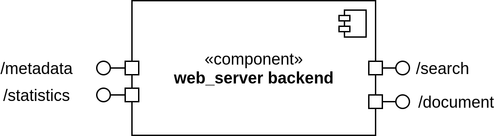
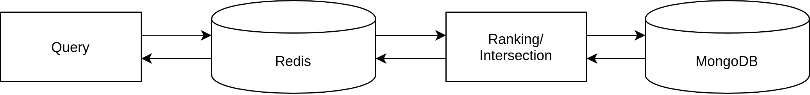
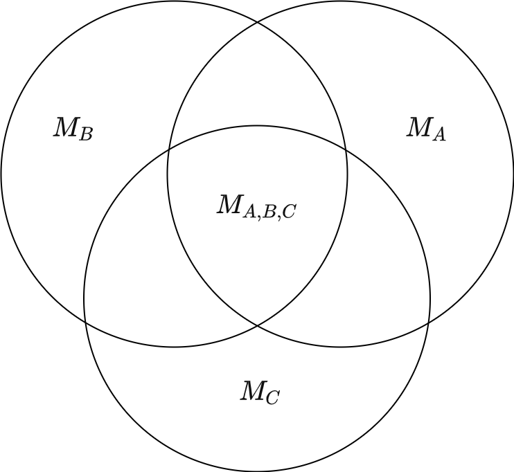

# Backend Server

The backend server is one of the main components of the search engine and functions as the information retrieval system. The backend is designed using the Node.js javascript runtime. Over the default packages the following packages for addressing the different kind of databases as well as for basic natural language processing tasks.

- natural https://github.com/NaturalNode/natural
- MongoDB Node.JS Driver https://mongodb.github.io/node-mongodb-native/
- Neo4j Javascript Driver https://neo4j.com/developer/javascript/, https://github.com/neo4j/neo4j-javascript-driver
- redis https://github.com/NodeRedis/node-redis

> Note: The required packages are defined in the `package.json` file. Running the command `npm install` should install these requirements automatically without further manual installation.

## API-endpoints

The API of the backend can be divided into two enpoints each used for the ad-hoc search and for the metadata analysis. In the following section the available API enpoints for those tasks are described in a high level (description, function calls, parameters). A detailed view over the fuctionality of the backend is described afterwards.

<p align="center">
  
</p>

### Ad-hoc search


**Description:** returns a subset of valid documents as well as suitable keyphrases based on a given query.

```javascript
app.get('/search', (req, res) => {...}
```

|Request Parameter|Type|Description|
|---|---|---
|`term`|`string`|the search term that should be used for the information retrieval task |
|`page`|`int`|the current page (as displayed in frontend) that should be taken as a starting point for the selection of the documents|
|`numDocs`|`int`|number of documents to be loaded|


|Respond Parameter|Type|Description|
|---|---|---|
|`documents`|`object`|loaded documents (as defined by search term page and number of documents to load)|
|`pages`|`int`|number of possible pages for the specified search query|
|`keyphrases`|`object`|important key phrases that are extracted from the highest scored documents from the current document retrieval|

</br>

### Metadata Analysis

#### Document Metadata

**Description:** returns basic information for a specified document (doc_id) containing the title, abstract, authors and involved institutions.

```javascript
app.get('/document', (req, res) => {...}
```

|Request Parameter|Type|Description|
|---|---|---
|`doc_id`|`int`|The document id of the document that should be loaded from db|


|Respond Parameter|Type|Description|
|---|---|---|
|`document`|`object`|loaded document|

</br>

#### Geographical Statistic

**Description:** returns a statistic of the geographical locations of institutions involved in a set of given papers (defined by the search term).

```javascript
app.get('/geo', (req, res) => {...}
```

|Request Parameter|Type|Description|
|---|---|---
|`term`|`string`|the search term that should be taken into account for the statistic |

|Respond Parameter|Type|Description|
|---|---|---|
|`countries`|`object`|country statistics containing the country code (used for visualization), the name of the country, the number of documents for each country and a placeholder for the color variable (variable is set in frontend)|

</br>

#### Author/ Institution Statistic

**Description:** returns a statistic for the authors or institutions involved in a selected paper which contains in the current state the number of documents published.

```javascript
app.get(`/statistics`, (req, res) => {...}
```

|Request Parameter|Type|Description|
|---|---|---|
|`type`|`string`|the type of statistic that should be processed (either `'author'` or `'institution'`) |
|`params`|`object`|additional parameters that are required in order to fetch the necessary data from the graph database|

</br>

## Information retrieval - Ad-hoc

### Preprocessing of the given search query

The first task in the ad-hoc information retireval process is the preprocessing of the search query given by the arguments of the  http request which is performed in the`getQeryFromTerm` function. In order to transform a given query, which can be either present in keywords or a free text, for the usage in the information retrieval system of the backend server the following three steps are hereby performed:

- **splitting:** The given search query is split by whitespaces into a list of individual strings. 
- **stemming:** A word stem is formed for each of the words from the split set using the [natural](https://github.com/NaturalNode/natural) package.
- **conversion into query:** In a final step the list of search terms are transformed to a valid MQL query which can be processed by the mongodb database.

```javascript
/**
 * @param the given search term present in keywords or a free text 
 * @returns a mongodb query 
 */
getQeryFromTerm = (searchTerm) => {...}
```

### Data retrieval from database

The previously constructed query is then utilized in the `getDocumentIdsFromMongodb` function in order to return a list of document objects containing a nested list of matched document ids, and further information as described in the documentation of the [data model](../../procesing/../processing/README.md), with size  where  corresponds to the number of word stems in the query. 


```javascript
/**
 * @param MQL query as given by getQeryFromTerm
 * @param the connection object to the mongodb database
 * @returns all matched document ids
 */
getDocumentIdsFromMongodb = (query, dbo) => {...}
```

These results are then consecutively ranked by their relevance regarding to the given search query, as described below, followed by an intersection of the given lists in order to return those documents that match all elements of the query. In a final step a subset of documents based on on the specified page and number of documents per pages, as defined in the request arguments, are loaded from the database using the `getDocumentsFromMongodb` function. 

```javascript
/**
 * @param 
 * @returns
 */
getDocumentsFromMongodb = (doc_ids) => {...}
```

As a second result of the ad-hoc search request a set of keyphrases that are relevant in the context of the given search term are processed. The query operation for the keyphrases is performed using the ten most relevant documents as determinded by the previously performed ranking using the `getKeyphrasesFromMongodb` function. The results containing the selected documents as well as the determined keyphrases are then concatenated into a single object and returned with the http response.

```javascript
/**
 * @param MQL query containing all vaid document ids
 * @param the connection object to the mongodb database
 * @returns the top ten most relevant matched keyphrases
 */
getKeyphrasesFromMongodb = (query, dbo) => {...}
```

In order to improve the performance of these operations, expecially when loading different pages for the same search query, an additional in-memory cache is implemented using a redis database. Hereby the processed result of a search query is stored in the redis cache using the `addDataToCache` function in order to speed up future requests which can be utilized using the `getDataFromCache` function. 


```javascript
/**
 * @param the given query for a search request
 * @param a object holding the current connection to the redis database
 * @returns the cached document ids and keyphrases
 */
getDataFromCache = (query, client) => {...}
```

```javascript
/**
 * @param the given query for a search request
 * @param a list of document ids that were loaded based on the specified query
 * @param a list of keyphrases that were loaded based on the specified query
 * @param a object holding the current connection to the redis database
 */
addDataToCache = (query, doc_ids, keyphrases, client) => {...}
```

 As a default 2GB are assigned to the redis database which is in most cases enough storage to cache all search results performed by the user given the size if the mongodb database and the expected amount of requests performed on such a local search engine. Nevertheless, to avoid the database from crashing if the elements cached in the database should exceed the assigned memory, the maxmemory configuration of the database is set to a least recent out strategy. 

</br>

<p align="center">
  
</p>

**Fig 2:** Processing pipeline for ad-hoc search using the MongoDB data model, the processing logic and an intermediate redis cache in order to improve responsiveness and speed expecially when loading different pages for the same search query.


#### Document Intersection

The initial retrieved lists of document ids that was queried based on the word stems contained by the search term still requires some additional processing in order to return desired documents that match all given word stems. Therefore a list intersection is performed as a part of the boolean retrieval model in order to find the mentioned subset of documents as displayed in Fig 2.

<p align="center">
  
</p>

**Fig 2:** Symbolic representation of three sets of document results based on a search query ,  and  determined on the basis of the components ,  und  of  a search query  und , as well as their final search result consisting of the intersection  und 

</br>

With regards to the memory and runtime requirements it is recommended to perform these operations on the database level instead of the application level. Nevertheless in this project the mentioned operations were moved to the application layer in order to make adjustments in respect to the document ranking and implementation of different IR algorithms as dynamic as possible. Due to the small size of the data set, no significant restrictions in speed and memory consumtion are expected.

The final intersection of the search results is performed based on  iterations of the 2-way-merge algorithm [1], where   corresponds to the number of lists containing the ranked documents that were loaded from the database as described before. This operation is performed in the function `intersect` which uses an implementation of the 2-way-merge algorithm that is located in the `mergeIntersect` method.


```javascript
/**
 * @param data nested list of documents identified by information retrieval
 * @returns ranked list of intersected documents identified by boolean IR
 */
intersect = (data) => {...}
```

```javascript
/**
 * @param L1 first list to intersect
 * @param L2 second list to intersect
 * @returns list of intersected items
 */
mergeIntersect = (L1, L2) => {...}
```


#### Document Ranking

In order to determine a ranking of the importance of the documents based on a given query, as described in the previous sections, a document ranking is performed by the backend using the function `ranking`.

```javascript
/**
 * @param documents containing the document id and the count of the term occurence 
 * @returns rank scores for all documents
 */
ranking = (data) => {...}
```


For the ranking process a modified version of the weighted zone scoring [2] is used. In the basic version of the mentioned scoring system the rank of the document is determined solely by the occurence of the word in a specific zone (e.g. title, abstract, body) of the document   prioritized by a set of weights  with .

<p align="center">
  
</p>

In order to reward documents with a high occurence of the word the scoring function is modified by a nomalized word count factor, where   is defined by the fraction of the number of occurences of the term in the current document devided by the highest occurence of the term in any document.

These normalized occurence factors are calculated in the backend application using the `getNormalizationFactors` and 
`getRankScore` function.

```javascript
/**
 * @param documents containing the document id and the count of the term occurence 
 * @returns normalization factors for all document zones (title, abstract, body)
 */
getNormalizationFactors(data) => {...}
```

```javascript
/**
 * @param count of the term occurence in the doument zones (title, abstract, body)
 * @returns rank score for the given document
 */
getRankScore(count_obj, norm_factors) => {...}
```

#### Country, Institution and Author Filters 

In order to enclose the search further, the search engine enables the user to filter the documents for additional specific properties. Currently those support filtering for specific locations, authors and institutions. The filtering process is directly integrated into the ad-hoc retrieval and is performed after the query of the matching document ids. In a first step the filters objects which are described in detail in the [frontend documentation](../frontend/README.md), transmitted by the frontend as a http request parameter, are grouped based on their category (country, author, institution) using the `groupFilters` method.

```javascript
/**
 * @param ungrouped filters (array of objects with the properties category and value)
 * @returns a list of grouped filtes (array of objects with the properties category and values)
 */
groupFilters = (arr) => {...}
```

Those grouped filters are then applied based on the filter category to the document ids that are matched to the current search term in parallel, using either the function `filterByCountries`, `filterByAuthor` or `filterByInstitution`. Afterward the results are merged using the same intersection technique as previously described in [Document Intersection](#document-intersection), as this technique has proven to be more efficient than applying the filters recursive on the list of document ids. 


```javascript
/**
 * @param matched document ids
 * @param list of grouped filters
 * @returns filtered list of document ids
 */
filter = (doc_ids, grouped_filters) => {...}
```


```javascript
/**
 * @param matched document ids
 * @param list of filter elements (either countries, authors or institutions)
 * @returns filtered list of document ids (by single category)
 */
filterByCountries = (doc_ids, countries) => {...}
filterByAuthor = (doc_ids, authors) => {...}
filterByInstitution = (doc_ids, institutions) => {...}
```

## Information Retrieval - Metadata

The following sections describe the basic functionality of the metadata analysis as a second information retrieval model in order to gain additional insights (on top of the ad-hoc search) on the research topic.
The current state of the metadata analysis can be divided into two main topics which are designed to provide additional information each on the geographical statistics of the publications for a given ad-hoc search request and on the overall statistics of the dataset regarding to the publications of different authors and institutions.

### Geographical Statistics

In order to retrieve the statistic of the geographical location of the institutions involved in a set of given papers, defined by a previous ad-hoc search request a query is performed on the metadata property graph which is described in detail in the [data model documentation](../../processing/README.md). The initial preprocessing for the database request is in its structure in most parts similar to the previously described ad-hoc search. Basis of the whole process is the search term that is given by the request parameter which is taken into account to fetch the relevant documents from the database. In most cases the intersected document ids are therefore loaded from the cache. If the data is not represented in the cache the data is loaded in a similar manner as described in the previously mentioned section. In this case the document ranking is skipped due to the performance impact of the ranking process, which has no value for the following retrieval of the geographical statistics.

The processed document ids are then taken into account in order to get the statistics of geographical location of institutions using the `getCountries` function that performs a search query on the Neo4j metadata property graph which is described in detail in the documentation  [document processing + construction of data models (CORD-19)](../../processing/README.md).

```javascript
/**
 * @param document ids as retrieved from the ad-hoc search
 * @returns a list of represented countries with additional information 
 *          (name, ISO3166 alpha-2 country code, number of publications)
 */
getCountries = (doc_ids) => {...}
```


### Author/ Institution Statistics

In order to get some additional information about the relevance of specific authors and institutions in the field of COVID-19 the metadata graph database can be queried for additional statistics (currently limited to the number of publications). The type of statistic that should be fetched from the database is defined by the `type` property in the http request. Based on this property the corresponding function, either `getAuthorsStatistics` or `getInstitutionStatistics`, is called. In those functions the required data is loaded from the Neo4j graph database and afterwards returned to the frontend via the http response.

```javascript
/**
 * @params names of authors represented in paper
 * @returns authors with corresponding number of publications found in the CORD-19 dataset
 */
getAuthorStatistics = (authors) => {...}
```

```javascript
/**
 * @params names of institutions represented in paper
 * @returns institutions with corresponding number of publications found in the CORD-19 dataset
 */
getInstitutionStatistics = (institutions) => {...}
```

## References

[1] Sunghwan Kim, Taesung Lee, Seung Won Hwang, andSameh Elnikety. List intersection for web search: Algo-rithms, cost models, and optimizations.Proceedings ofthe VLDB Endowment, 12(1):1–13, 2018.

[2] Christopher D. Manning, Prabhakar Raghavan, and Hinrich Schütze. 2008. Introduction to Information Retrieval. Cambridge University Press, USA.