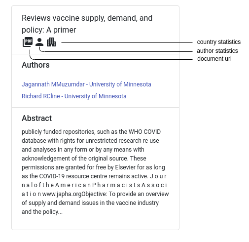
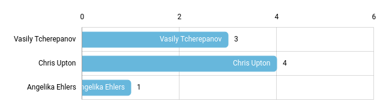

# Web Application - Frontend

The interface of a search engine is an elementary component for an efficient search process and the visualization of the search results in order to grasp the determined data as fast as possible.
In the following sections an overview over the main functionality of the search engine frontend application, which was developed in order to provide the mentioned functionality in the context of the CORD-19 search engine, as well as the basic code structure behind this application should be described.

## Overview - React Application

As a basic frame for the frontend application the javascript library React was used in order to provide an efficient way to structure the data in an interactive web application. On top of the provided functionality this application uses the following packages in order to provide additional content for both for the visualization of the data and the visual layout of the application:

- amCharts: https://www.amcharts.com/
- Bootstrap for React: https://react-bootstrap.github.io/
- Material-UI: https://material-ui.com/

> **Note:** The required packages are defined in the `package.json` file. Running the command `npm install` in the `/frontend` directory should install these requirements automatically without further manual installation steps.

</br>

The developed user interface, as depicted in Fig 1., which represents the main interaction element, provides the user with seven key features which are either used in order to enable the ad-hoc or metatada search functionality. Each of those elements are marked in the graphic below 
and are each described in the following sections in the given order.

<p align="center">
  
</p>

**Fig 1:** High level layout of the search engine frontend application, which was implemented using React.js, including functionality for both ad-hoc and metatada search.


### 1. Ad-Hoc Search

The ad-hoc search component provides the basic functionality for a free text search in the common text field structure (as depicted in Fig 3). The implementation of this component is hereby realized in the `Header` component.

When a new search query is submitted either by pressing the search button or by pressing the enter key a new search request is initialized by the `searchQueryChange` function.

```javascript
/**
 * @param updated search query
 */
searchQueryChange = (searchTerm) => {...}
```

In order to avoid redundant requests if the search query hasn't changed since the last search request the query is checked before sending further requests to the backend. If the search term has changed, a request is sent to the backend using the `loadDocuments` function. The recieved information is then saved into a state variable for further processing and vizualization tasks.


```javascript
/**
 * @param a given search query
 */
loadDocuments = (newQuery) => {...}
```

### 2. Document  List

The visualization of the search results which were determined in the ad-hoc information retrieval, as described in the previous section, is provided as implemented in well-known search engines as a list of documents containing basic information such as the document title, the authors involved in the paper and the first 500 characters from the papers abstract. This functionality is implemented in the `Documents` component which is updated each time the loadedDocuments state variable is changed by a new search request.

### 3. Additional Relevant Keyphrases

For each search topic defined by a given search query, the search engine identifies a set of keyphrases based on the documents which can be taken as a starting point for a further analysis of the research environment. The list of keyphrases is updated each time a new search query is performed using the `loadDocument` function which communicates whith the backend over the `/search` endpoint (for further information refer to the [Backend Server](../backend/README.md) documentation). 
The extracted keyphrases are then visualized using the `SimilarTopics` component as a container for the individual keyphrases which are displayed each using an instance of the `Badge.js` component.
When one particular instance of the provided keyphrases is selected in the user interface by selecting one of the badges, the given keyphrase is set as the new search query.

</br>

<p align="center">
  
</p>

**Fig 3:** Visualization of the extracted similar keyphrases for the search term "personal contacts" and the update of the keyphrases when a new search query is selected out of the keyphrases list.

</br>

### 4. Document Filters 

In order to enclose the results obtained from the ad hoc search further a filter system can be used that currently contains the following filter categories:
- countries
- institutions
- authors

The filters can hereby be selected either in the `WorldMap` component by selecting one of the scatter plot items or by selecting an author or an institution in the `Metadata` component.
Further information on those components are provided in the [Document Metadata](#5-document-metadata) or the [ Visualization of the Geographical Locations involved in a Paper](#6-visualization-of-the-geographical-locations-involved-in-a-paper) section.
<p align="center">
  
</p>

**Fig 4:** multiple filters, containing both a country and instituion category, applied to the search results of an given search term

</br>

After selecting a new filter from the previous categories the current search results are updated automatically. The selected filters can also be deselected by removing it using the delete button of the unwanted filter. 

The information of each selected filters are represented for further processing in the backend using a javascript object with a category and value property defined:

```json
filter = {
  'category': "country",
  'value': "United States"
}
```

In order to update the search results with the currently selected filters applied the function `loadDocuments` is used which sends a http request to the backend as previously described in the [Ad-hoc search bar]() section. The `loadDocuments` function is called by the `selectFilter` which is again triggered by the visual components containing data that can be used as a filter (`WorldMap`, `Metadata`).

### 5. Document Metadata

For each selected document the main metadata containing the document title, the involved authors and the corresponding institutions as well as the documents abstract are shown in the document metada section. This sections provide additional insights and structure compared to the basic list of documents as described before. In addition other controls such as the selection of the author or institution statistics (as described in [Author/Institution Statistics](#7-authorinstitution-statistics)) or a menu control for opening the paper in a new tab are displayed in this component as displayed in Fig 4.

<p align="center">
  
</p>

**Fig 5:** Document Metadata component initialized with a selected document

</br>


The described component is realized in the `Metadata` react component. After selecting a document from the Document List of the ad-hoc search which triggers the `selectDocument` function this component is initialized whith the corresponding document data.

```javascript
/**
 * @param: document id of the selected document
 */
selectDocument = (doc_id) => {...}
```

On the other hand the functions `onStatisticsClicked` and `onElementClicked` which are used for updating the document statistics and the selection of a new filter are initialized with the corresponding document parameters.


### 6. Visualization of the Geographical Locations involved in a Paper

The visualization of an overview over the geographical locations of the document retrieved can provide some additional insights expecially in a search context where geographical differences can result in different search results (e.g. mortality rates, reproduction number, etc.). In order to provide the mentioned functionality in this application the localization of the institutions involved in the publications are used as an indication of the affiliation of the paper. Cases where institutions of a specific country publish over a specific situation in another country are herby not taken into account.

The extracted information is hereby provided the user via a world map which visualizes the absolute contribution of each country to the specified topic.
<p align="center">
  
</p>

**Fig 6:** Vizualization of the geographical locations involved in the paper determined by the location of the institutions associated with the authors  

</br>

After updating a search query the map object which is located in the `WorldMap` component gets updated with the data fetched by the `loadCountries` function. 


```javascript
/**
 * @params: None -> required information is loaded from the state variable
 */
loadCountries = () => {...}
```

>Note: The displayed map provides a general overview of the global distribution of the publications and is therefore not updated based on selected filters.

The data used in order to update the chart object  is hereby loaded for each search term from the `/geo` endpoint of the backend and is returned in a structured type as a array of json objects with the following structure, which is then processed by the `WorldMap` component:

```json
{ 
  id: "CA" 
  name: "Canada", 
  value: 184, 
  color: "#000000"
}
```

### 7. Author/Institution Statistics

One of the most important tasks in a literature review is the evaluation of the relevance of a given paper. In order to perform this task both substantive criteria as well as the boundary conditions given by the documents metadata such as the publication date or the involved authors and institutions should can be taken into account. In order to faciliate a fast evaluation of the relevance of the authors and institutions in the scope of COVID-19, a statistic (number of publications) is determined for each selected paper. 


<p align="center">
  
</p>

**Fig 7:** Visualization of the ammout of publications in the context of the CORD-19 dataset published by the authors associated with a selected paper  

</br>

In order to provide the relevant information either on the author or the institution statistics for a selected paper a request is send to the backend using the `/statistics` endpoint using the `fetchStatistics` function.
As a default the author statistic is fetched after the selection of a document. The institution statistics can be alternatively selected in the metadata componenent. When one of the statistics types is returned from the backend the data is then visualized using the `BarChart` react component.

```javascript
/**
 * @param the authors object of a selected document containing both 
 *        the authors name as well as the institution names
 * @param the type of the /statistics request ('authors', 'institutions')
 */
fetchStatistics = (authors_obj, type) => {...}
```