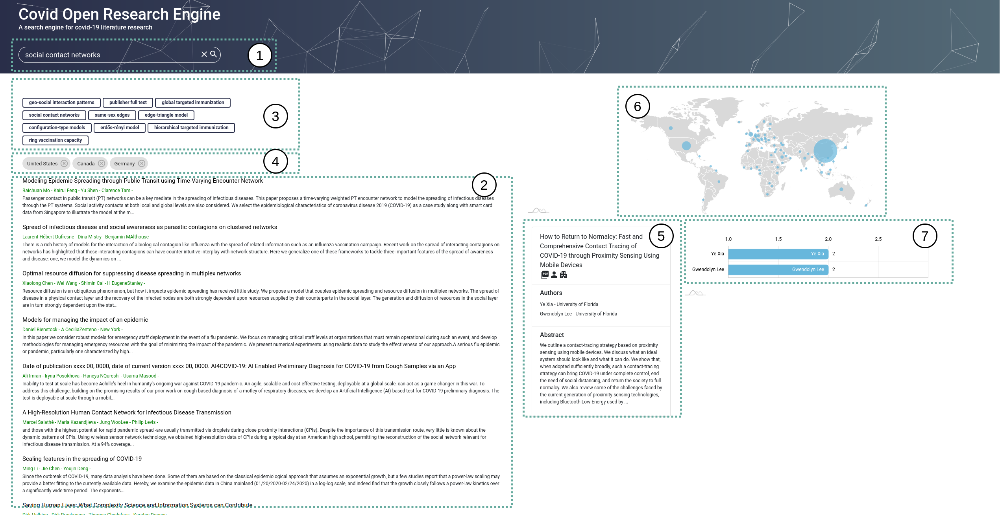
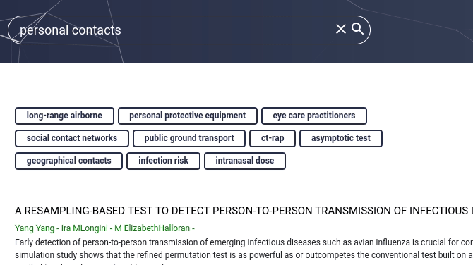
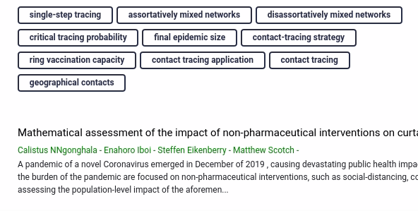

# Web Application - Frontend

The interface of an search engine is an elementary requirement for an efficient search and the visualization of the search results.
In the following sections an overview over the main functionality of the search engine frontend application as well as the basic code structure behind this application should be given.

## Ovierview - React Application

In this application the following node packages are required in addition to the default packages:

- amCharts: https://www.amcharts.com/
- Bootstrap for React: https://react-bootstrap.github.io/
- Material-UI: https://material-ui.com/

> **Note:** The required packages are defined in the `package.json` file. Running the command `npm install` in the `/frontend` directory should install these requirements automatically without further manual installation steps.

</br>

The user interface, as depicted in Fig 1. provides the user with seven key features which are each used either in order to enable functionality for the ad-hoc or metatada search. 

<p align="center">
  
</p>

**Fig 1:** High level layout of the search engine frontend application implemented using React.js including funcionality for both ad-hoc or metatada search.


### 1. Ad-Hoc Search Bar

### 2. Document  List

### 3. Additional relevant Keyphrases

For each search topic defined by a given search query the search engine identifies a set of keyphrases based on the documents which can be taken as a start point for a further analysis of the research environment. The list of keyphrases is updated each time a new search query is performed. When one of the keyphrases is selected by the user the given term is set as the new search query.

</br>

<p align="center">
  
</p>

**Fig 3:** Visualization of the extracted similar keyphrases for the search term "personal contacts" and the update of the keyphrases when a new search query is selected out of the keyphrases list.

</br>

In the React application the extracted keyphrases are visualized using the `SimilarTopics` component as a container for the individual keyphrases which are displayed using the `Badge.js` component. The information used is fetched from the web application backend using the `loadDocuments` function which sends a http request, which is further described in the [Backend Server](../backend/README.md) documentation, to the `/search` endpoint of the backend.

### 4. Document Filters 

***TODO:***

The following categories can currently be selected as a filter for the ad-hoc search:
- countries
- institutions
- authors

<p align="center">
  
</p>

After selecting a new filter from the previous categories the previous search results are updated automatically. The selected filters can also be deselected by removing it using the delete button of the unwanted filter. The information of the selected filters are represented for further processing in the backend using a javascript object with a category and value property defined:

```json
filter = {
  'category': "country",
  'value': "United States"
}
```

In order to update the search results with the currently selected filters applied the function `loadDocuments` function is used which sends a http request to the backend as previously described in the [Ad-hoc search bar]() section. The `loadDocuments` function is called by the `selectFilter` which is in turn triggered by the visual components containing data that can be used as a filter (`WorldMap`, `Metadata`).


### 5. Document Metadata

### 6. Visualization of the Geographical Locations involved in a Paper

In order to present the user a overview of the locations where published

>Note: The displayed map provides a general overview of the global distribution of the publications and is therefore not updated based on selected filters.

<p align="center">
  
</p>


### 7. Author/Institution Statistics

